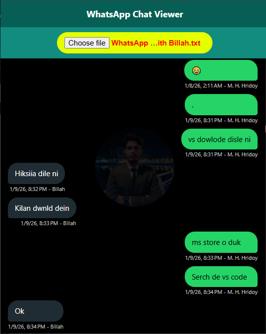

## Upload Date: <i style="color:#25D366;">12 March 2026</i>

# 💬 WhatsApp Inbox Viewer

A simple and beautiful **WhatsApp chat viewer** that converts exported **.txt chat files** into a **WhatsApp-style conversation interface** directly in your browser.

Built using **HTML, CSS, and JavaScript**.
## Demo


----




---

## 📸 Preview

Upload your exported WhatsApp chat file and instantly see the conversation in a clean WhatsApp-style layout.

```
Upload Chat (.txt)
        ↓
Beautiful WhatsApp Style Chat Interface
```

---

## ✨ Features

* 📂 Upload exported **WhatsApp .txt chat file**
* 💬 Messages displayed in **WhatsApp chat bubble style**
* 🟢 **User messages (green)** and **other messages (dark)** layout
* 🕒 Shows **message time and sender name**
* 🖼 Fixed center background image
* 📱 **Responsive design** for desktop and mobile
* ⚡ Instant chat rendering in the browser
* 🔽 Auto scroll to the latest message

---

## 🛠 Technologies Used

* HTML5
* CSS3
* JavaScript (Vanilla JS)

---

## 📂 Project Structure

```
whatsapp-inbox-viewer
│
├── index.html
├── funtion.js
└── README.md
```

---

## 🚀 How to Use

1. Open **WhatsApp**
2. Export chat from any conversation
3. Choose **Without Media**
4. Save the **.txt file**
5. Open this web page
6. Upload the `.txt` file

Your chat will instantly appear in a **WhatsApp-style interface**.

---

## 🔮 Future Improvements

* 🔍 Message search
* 📅 Date separators
* 🖼 Media support
* 👤 Profile avatars
* 📊 Chat statistics

---

## 👨‍💻 Author

**Murad Hasan Hridoy**

GitHub:
https://github.com/mhhridoy7907

---

⭐ If you like this project, don't forget to **star the repository**.
